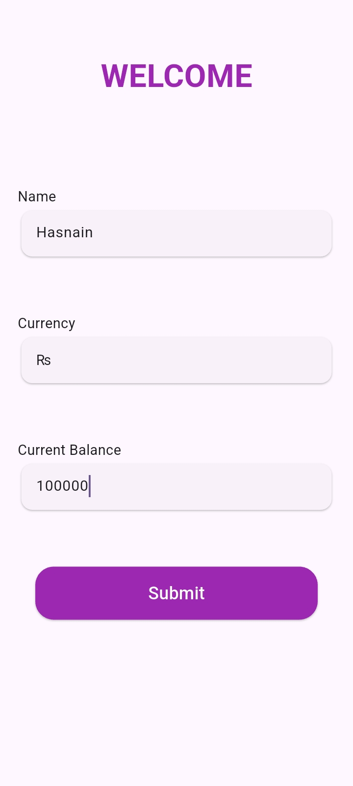
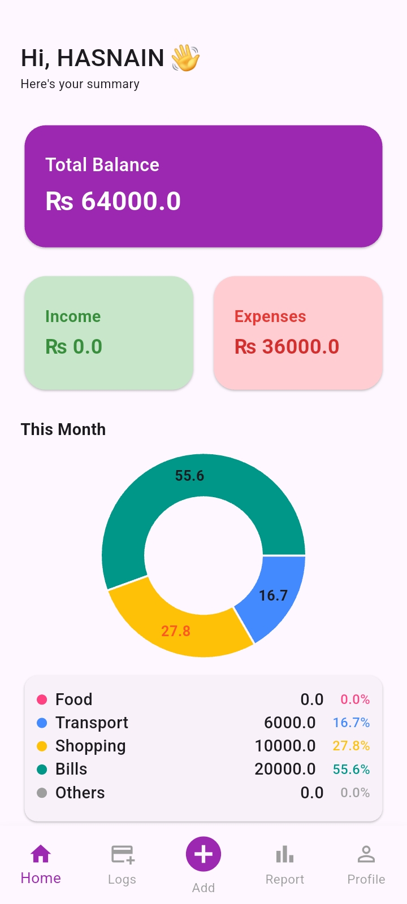
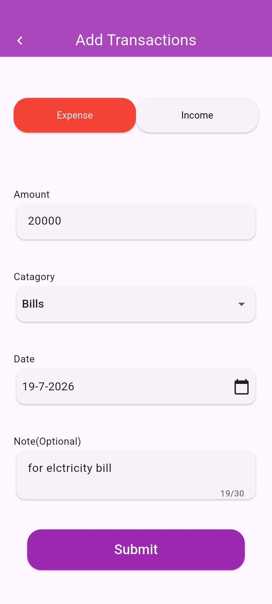
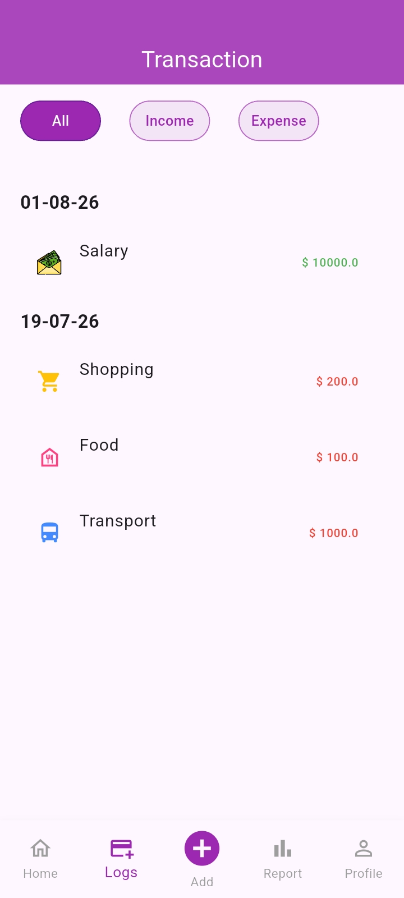
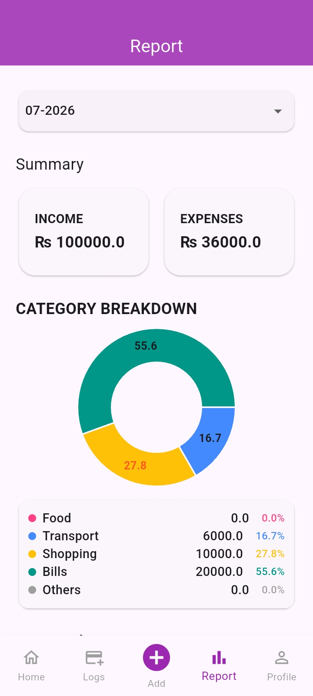

# 💰 Expense Tracker

A modern Flutter application for managing daily income and expense transactions. The app securely stores data locally using SQLite and provides detailed monthly reports with interactive pie charts to help users monitor their spending habits.

---

## ✨ Features

- 💰 Add income and expense transactions
- ✏️ Edit existing transactions
- 🗑️ Delete transactions
- 📋 View complete transaction history
- 📅 Generate monthly financial reports
- 📊 Interactive pie chart for expense visualization
- 💾 Offline data storage using SQLite
- ⚡ Efficient state management with Provider
- 🔒 Save user preferences using SharedPreferences
- 📱 Responsive UI optimized for different screen sizes

---

## 🛠️ Tech Stack

- Flutter
- Dart
- SQLite (sqflite)
- Provider
- SharedPreferences
- fl_chart

---

## 📦 Packages Used

- provider
- sqflite
- path
- path_provider
- shared_preferences
- fl_chart
- intl

---

## 📂 Project Structure

```
lib/
├── Data/
├── Models/
├── Presentation/
├── Repository/
├── Utils/
└── main.dart
```

The project follows a clean and organized folder structure, separating UI, business logic, data handling, and utilities for better maintainability.

---

## 🚀 Getting Started

### 1. Clone the Repository

```bash
git clone https://github.com/Hasnain0420/expense_tracking_app.git
```

### 2. Open the Project

Open the project using **Android Studio** or **Visual Studio Code**.

### 3. Install Dependencies

```bash
flutter pub get
```

### 4. Run the Application

```bash
flutter run
```

---

## 📸 Application Screenshots

### 👋 Welcome Screen



### 🏠 Dashboard



### ➕ Add Transaction



### 📋 Transaction History



### 📊 Monthly Report



---

## 🎯 Future Improvements

- ☁️ Firebase Cloud Backup & Sync
- 📄 Export Reports as PDF
- 🌙 Dark Mode

---

## 👨‍💻 Developer

**Hasnain**

Flutter Developer

---

### ⭐ If you found this project helpful, consider giving it a star on GitHub.